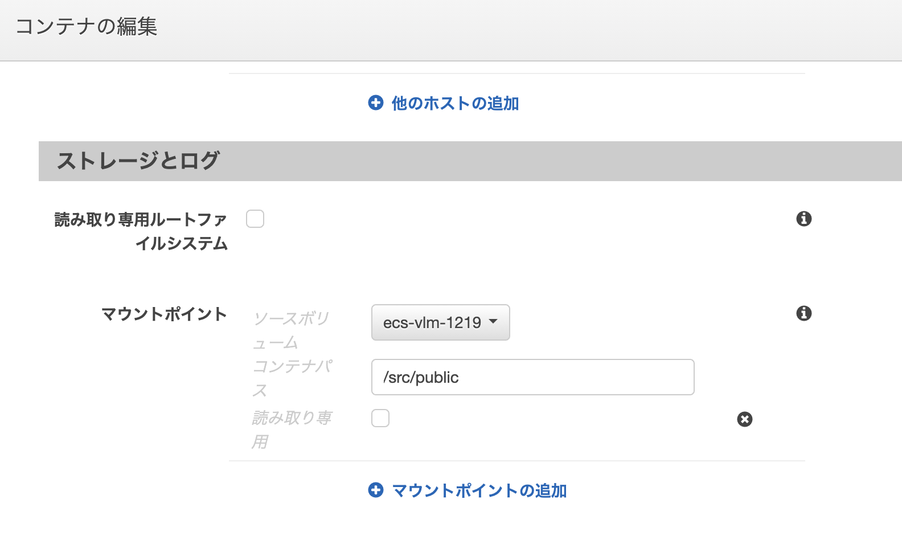

# ALBはお金かかる？

## タスクがrunningだと課金されるの？

タスクが終了するまで課金。終了とはストップなのか？

## EC2より高い？

EC2タイプとFargateタイプがあるが、EC2タイプはその名の通り、作成したEC2上でコンテナを動かすもの。この場合は、このEC2の利用料がかかる。Fargateタイプは前述のEC2をユーザーが意識しないで良い。その上にレイヤーがあって、そこでコンテナを動かすイメージ。こちらの方が料金は高くなる。

## webサーバーに必要なメモリ量って？

## S3やEFSのマウントは出来るの？

S3は元々出来る。EFSも出来るようになった。

https://dev.classmethod.jp/articles/efs-fargate/

## SSMでSSH

SSHを扱うためのIAMロールが必要

```
Activation Code   IU3u******
Activation ID   42e9c******
```

# コンテナにsshで入る

## 参考

https://qiita.com/ryurock/items/fa18b25b1b38c9a0f113
https://enokawa.hatenablog.jp/entry/2019/09/05/104545

## 詰まったポイント

- ssm-agentのコンテナへのインストール
参考としたubuntuのコードcentosで動かすための変更方法がわからなかった
- ssmインストール後、ログを適切な位置に配置する必要がある
- アクティベーションの有効期限が切れていた
- shellスクリプトが最初の業しか実行されていなかった
expressをフォアグラウンドで実行してしまうなど、その先の記述が実行されないような書き方をしていた
- centosイメージにはpythonが含まれているので参考リンクと違いpythonのインストールは不要
- タスク定義のIAMロールでは、SSMへのアクセスを許可する
下記2つは必須
AmazonSSMManagedInstanceCore
AmazonECSTaskExecutionRolePolicy

## 手順

- DockerImageにssm-agentをインストール
- ハイブリッドアクティベーションを作成
ロールを与る、registerLimitを多めに設定（コンテナが起動するたびに必要）
- 上記アクティベーションをパラメーターストアへ登録
- コンテナでハイブリットアクティベーションを使う設定をする
- コンテナでssm-agentの起動スクリプト（自前で用意）を叩く
シェルスクリプトを用意、シェルスクリプト中の変数はパラメーターストアのもの
- 本当に入れるかの確認


# アクティベーションとは？

SystemsManagerでshellログインするために必要なクレデンシャルのようなもの。アクティベーションコードとIDをAWSで作り、作成されたコードとIDを管理したいインスタンスに設定すると、SSMでインスタンス・コンテナへのshellログインが可能になる。

# EFSをアタッチ

## 参考

https://zenn.dev/cumet04/articles/fargate-with-efs

## セキュリティグループ

コンテナとEFSに同じセキュリティグループを割り当てる。NFS（2049）のインバウンドを許可する。

## 参考画像

